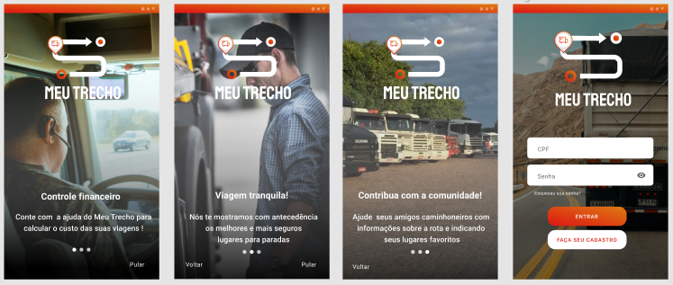
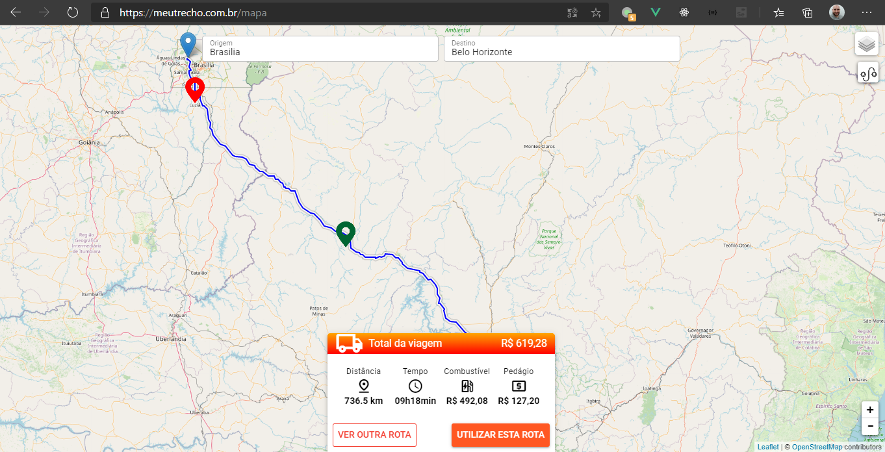

# Meu Trecho
Projeto criado durante o HACKATHON CCR:
BOAS IDEIAS A CAMINHO.

---------------------------------------

---------------------------------------

## Dependencias para desenvolvimento

> Necessário quasar cli
http://quasar.dev

## Tecnologias

> Web e Mobile
>- VueJs
>- Quasar Framework

## Integrações

> Mapa
>- Leafletjs
>- Openstreetmap

---------------------------------------

## Equipe Hackathon CCR

> UX:
>- Carol 

> Business:
>- Marcia 

> DEV:
>- Capuvilla 
>- Renan 
>- Ernandes 

---------------------------------------

## Prototipo

https://www.figma.com/proto/WqjtPeLI0doXzRQ4Mzjwrl/CCR?node-id=137%3A848&scaling=scale-down
